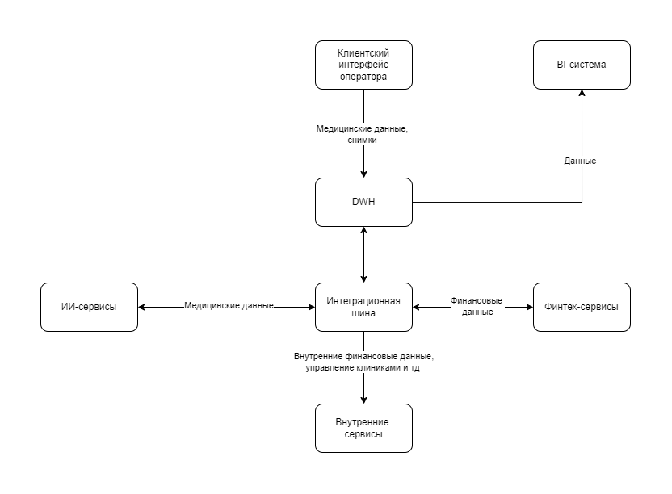
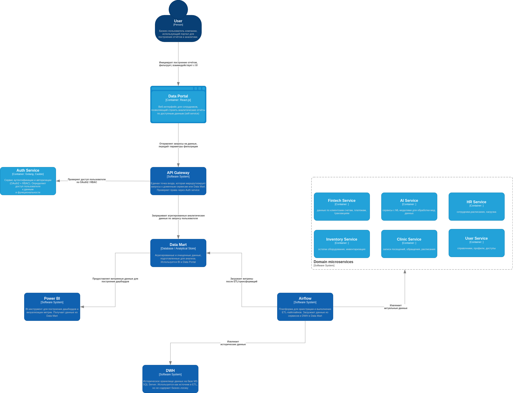

### Задание 1
- Спроектируйте архитектуру системы через год. Составьте диаграмму контейнеров в модели C4.
- Опишите проблемные места. Сделайте это в удобной для вас форме. Например, можете использовать список или таблицу.
Постарайтесь формулировать описания так, чтобы они были понятны не только инженерам, но и бизнесу.
- Приоритизируйте выявленные проблемы. Для этого вы можете использовать методы, которые изучили на курсе. 
Например, MoSCoW или матрицу Эйзенхауэра.


### Архитектура системы "Future 2.0" As-is:


1. Отсутствие доменной структуры:
    - Все направления работают через общий DWH.
    - Любые изменения или новые сервисы требуют доработок в централизованной базе и шине данных.

2. Один монолитный DWH:
    - Источник, логика, агрегаты, отчёты.
    - Бизнес-правила реализованы в SQL, вьюхах и хранимках.
    - Испольуется как центральная точка интеграции для всех направлений.

3. Устаревший клиентский интерфейс, не юзер-френдли:
   - Подклюется напрямую к DWH.
   - Содержит логику отображения и бизнес-логику.

4. BI-система подключена прямо к DWH:
    - Построение отчётов вручную.
    - Низкая производительность, долгие выборки.
    - Долгое время ожидания при построении сложных срезов.

5. Интеграции через централизованную шину данных:
    - Синхронная маршрутизация, сильная связонность компонентов системы.
    - Надо менять маршруты при добавлении новых участников маршрутизации.
    - Нет возможности хранения событий/сообщений внутри шины.
    - Возможна потеря сообщений.

6. Финтех-сервисы, ИИ-сервисы, внутренние системы:
    - Обменивались данными только через шину и DWH.
    - Финтех на Go/Java, ИИ — на Python.
    - Отдельной ответственности за домены не было.


### Архитектура системы "Future 2.0" To-be:


1. Data Portal:
   - Работает через API Gateway и проверяет доступы через Auth Service.
   - Современный интерфейс, где пользователь сам строит отчёты.

2. Data Mart:
   - Разгружает основной DWH.
   - Подготовленные и агрегированные срезы данных.
   - Используется BI и порталом.

3. Authorization Service:
   - Управляет доступом к данным по политике RBAC.

4. ETL-платформа (Airflow):
   - Логика вынесена из SQL в управляемые маршруты данных с веб-интерфейсом.
   - Делает трансформации и загружает в Data Mart.
   - Извлекает данные из сервисов и DWH.

5. Разделение на домены:
   - Каждый сервис управляет своими данными и логикой.
   - Появились микросервисы: Fintech, Clinic, AI, HR, Inventory.

6. Обновлённые BI-инструменты:
   - Подключены к Data Mart, а не к DWH.


### Сравнительная таблица
| Было                                                          | Стало                                              |
|---------------------------------------------------------------|----------------------------------------------------|
| Централизация логики и аналитики в одном DWH                  | Распределённая архитектура по доменам              |
| PowerBuilder — старый интерфейс, обращается напрямую к БД     | Портал самообслуживания — современный UI через API |
| Нет разграничения доступа                                     | Настроена политика безопастности (OAuth2 + RBAC)   |
| Вся бизнес-логика в БД (представления, хранимые процедуры)    | Бизнес-логика реализуется в сервисах и ETL         |
| BI-инструменты работают напрямую с DWH                        | BI и портал работают с Data Mart                   |
| Apache Camel — централизованная шина                          | API и самостоятельные домены                       |
| Трудно масштабировать системы, добавлять новые бизнес-функции | Независимое развитие доменов                       |
| Сложно поддерживать и изменять систему, низкий time-to-market | Гибкая, расширяемая архитектура                    |
| Медленная генерация отчётов                                   | Быстрая аналитика через витрины                    |


### Приоритизация шагов по переходу к новой архитектуре

Переход от централизованной архитектуры (DWH + PowerBuilder) к распределённой (Data Mart + Domain Services) требует пошагового подхода.
Ниже представлены этапы, отсортированные по степени влияния на устойчивость, выгоду для бизнеса и готовность к внедрению.

##### Принципы приоритизации (MoSCoW):
- ```Must``` — критично для начала трансформации и получения бизнес-ценности.
- ```Should``` — желательно реализовать как можно скорее, но не блокирует запуск.
- ```Could``` — можно реализовать позже.
- ```Won’t``` — осознанно исключено из ближайших этапов, может быть выполнено в будущем.

| №  | Шаг                                          | Цель                                                         | Описание                                                                      | Приоритет (MoSCoW) |
|----|----------------------------------------------|--------------------------------------------------------------|-------------------------------------------------------------------------------|--------------------|
| 1  | Вынести бизнес-логику из DWH в ETL           | Убрать зависимость от хранимых процедур и представлений в БД | Перенос расчётов в Airflow. Возможность тестирования и версионирования.       | Must               |
| 2  | Настроить Data Mart                          | Ускорить доступ к аналитике                                  | Создание витрин по ключевым метрикам. Подключение BI и портала.               | Must               |
| 3  | Разделить систему на домены                  | Независимая эволюция направлений                             | Выделение Fintech, Clinic, HR и других в отдельные сервисы с собственной БД.  | Must               |
| 4  | Развернуть портал                            | Снизить нагрузку на BI и DWH                                 | Веб-интерфейс, через который пользователи сами строят отчёты.                 | Should             |
| 5  | Внедрить Auth Service                        | Защита данных                                                | Контроль доступа к данным через роли. Подключение к порталу и BI.             | Should             |
| 6  | Перенести BI-инструменты на Data Mart        | Повысить производительность                                  | BI должен читать данные только из витрины, а не из сырого DWH.                | Should             |
| 7  | Начать миграцию данных из DWH в домены       | Удалить дублирующиеся источники                              | Постепенная передача хранения и ответственности за данные в доменные сервисы. | Should             |
| 8  | Внедрить Data Governance                     | Управлять качеством данных                                   | Lineage, владельцы, документация моделей и витрин.                            | Should             |
| 9  | Реализовать стриминговую архитектуру (Kafka) | Подготовить к real-time аналитике                            | Добавление real-time потока событий и алертов.                                | Could              |
| 10 | Полный отказ от PowerBuilder                 | Уйти от устаревшего UI                                       | Требует подготовки процессов и переноса логики в новый и нтерфейс.            | Won’t              |
| 11 | Полная миграция DWH на первом этапе          | Снизить зависимости от DWH                                   | Риски высоки, переход будет постепенным.                                      | Won’t              |
| 12 | Реализация полной real-time аналитики в MVP  | Обеспечить быструю реакция на данные                         | Для MVP не требуется, будет внедрено позже.                                   | Won’t              |

### Результаты:

- Аналитика работает быстрее.
- Бизнес-пользователи могут работать с данными напрямую.
- Архитектура стала модульной, масштабируемой.
- Повышена безопасность доступа к данным.