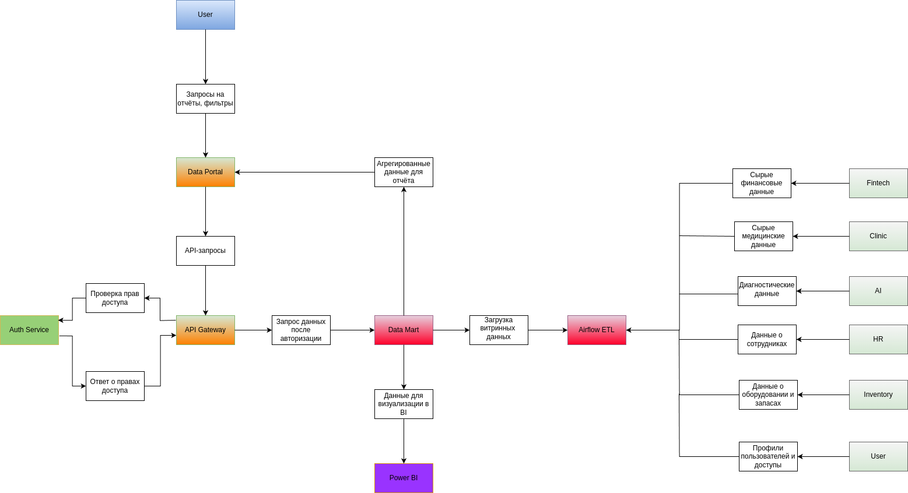

### Задание 2
- Разделите систему на домены, чтобы их можно было независимо развивать без необходимости реализовать новую логику в DWH.
- Отразите потоки данных между доменами. Для этого отрисуйте Data Flow Diagram. Отразите на ней запланированные изменения в архитектуре.
- Аргументируйте логику разделения на домены. Опишите преимущества, которые получит компания, если разделит систему на домены так, как вы предлагаете.

### Разделение системы на домены с аргументами:
Разделение системы на домены позволяет обеспечить независимое развитие бизнес-направлений
без необходимости изменять центральное хранилище данных (DWH).

Ниже представлены выбранные домены, их ограниченные контексты, зоны ответственности и обоснование.

| Домен     | Ограниченный контекст                | Зона ответственности                                                 | Аргументация                                                                                             |
|-----------|--------------------------------------|----------------------------------------------------------------------|----------------------------------------------------------------------------------------------------------|
| Fintech   | Финансовые продукты и операции       | Кредиты, платежи, финансовые транзакции клиентов                     | После покупки банка финансовые услуги стали отдельной бизнес-линией со своими процессами и требованиями. |
| Clinic    | Медицинские процессы                 | Управление пациентами, записями на приём, операционными планами      | Клиники — основа бизнеса Future 2.0. Медицинские процессы требуют обособленного управления.              |
| AI        | Обработка медицинских данных         | Анализ медицинских снимков, диагностика заболеваний, прогнозирование | ИИ-сервисы анализируют медицинские данные отдельно от клинических и финансовых систем.                   |
| HR        | Управление персоналом                | Найм, расписания сотрудников, обучение, расчёт нагрузки              | Крупная компания нуждается в отдельной системе для управления персоналом всех подразделений.             |
| Inventory | Управление оборудованием и запасами  | Учёт техники, закупки, инвентаризация, обслуживание оборудования     | После интеграции с производителями электроники требуется учёт оборудования и материалов.                 |
| User      | Управление пользователями и доступом | Регистрация, аутентификация, профили пользователей, контроль доступа | Центральное управление пользователями и доступами критично для безопасности всех доменов.                |

---

### Диаграмма потоков данных (DFD):
