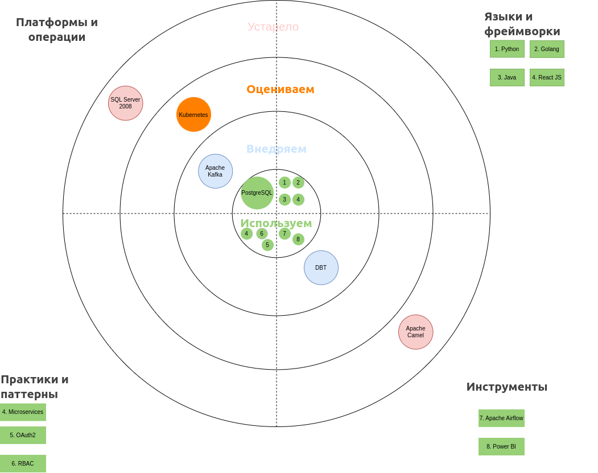

### Задание 3
- Сформируйте технический радар. Отразите на нём текущие технологии и методологии, а также предлагаемые изменения и технологии, которые сопутствуют основному стеку. 
Оформите радар в виде таблицы или круговой диаграммы.
- Составьте роадмап. Отразите здесь изменения в технологическом ландшафте компании. 
Радар должен содержать этапы, их результаты, ответственные команды и ресурсы, которые потребуются.
Оформите роадмап в draw.io или в другом инструменте на свой выбор.
- Обоснуйте изменения. Опишите, зачем нужен каждый из этапов, которые вы включили в роадмап. Можете сделать это в том же файле, что и сам артефакт.

## Технический радар:

## Roadmap по изменению технологического ландшафта компании "Future 2.0":

| Этап | Действие                                               | Результат                                                                       | Ответственные                           | Ресурсы                               | Временной интервал |
|:-----|:-------------------------------------------------------|:--------------------------------------------------------------------------------|:----------------------------------------|:--------------------------------------|--------------------|
| 1    | Вынести бизнес-логику из DWH в ETL (Airflow/dbt)       | Снижение зависимости от хранимок процедур и представлений, ускорение разработки | Data Engineering команда                | Airflow, DBT, Python, Go разработчики | Q1                 |
| 2    | Создать Data Mart для витринных данных                 | Быстрая аналитика без нагрузки на DWH                                           | Data Engineering команда                | PostgreSQL/Redshift                   | Q1                 |
| 3    | Разделить систему на бизнес-домены                     | Независимое развитие бизнес-доменов                                             | Архитекторы + доменные команды          | Аналитики                             | Q1-Q2              |
| 4    | Развернуть Data Portal (портал самообслуживания)       | Автоматизация аналитических запросов                                            | Web Development команда                 | Frontend                              | Q2                 |
| 5    | Внедрить систему авторизаций (OAuth2 + RBAC)           | Защита данных и разграничение доступа                                           | Security команда + Backend разработчики | OAuth-сервер                          | Q3                 |
| 6    | Перенести BI-инструменты на Data Mart                  | Быстрое построение отчётов без обращения к DWH                                  | BI команда                              | Power BI                              | Q3                 |
| 7    | Внедрить Data Governance процессы                      | Повышение качества данных, контроль владения данными                            | Data Governance команда                 | Axon Data Governance                  | Q3-Q4              |
| 8    | Реализовать стриминговую интеграцию через Apache Kafka | Подготовка к real-time аналитике и алертам                                      | Data Engineering команда                | Kafka кластеры                        | Q4                 |

## Обоснование этапов Roadmap

1. Вынести бизнес-логику из DWH в ETL (Airflow/dbt)
**С какой целью:**  
    - Вся логика расчётов реализована в устаревшей реализации - SQL-скрипты и хранимые процедуры.
    Это мешает развитию и требует долгих изменений даже для простых задач.
    Перенос ETL-логики в отдельную платформу (Airflow, dbt) сделает процессы гибкими, версионируемыми и легко поддерживаемыми.

2. Создать Data Mart для витринных данных
**С какой целью:**
    - Data Mart позволит строить отчёты и анализировать данные без прямой нагрузки на DWH.
    Это ускорит построение отчётов и разгрузит основной сервер. Кроме того,
    подготовит почву для масштабирования новых бизнес-направлений.

3. Разделить систему на бизнес-домены
**С какой целью:**
    - Разделение на независимые домены (Fintech, Clinic, AI, HR, Inventory) снизит связанность компонентов,
    упростит развитие новых бизнесов и минимизирует риски при изменениях в отдельных частях системы.

4. Развернуть Data Portal (портал самообслуживания)
**С какой целью:**
    - Пользователи смогут самостоятельно строить нужные им отчёты без обращения к разработчикам или BI-команде.
    Это сократит time-to-market для аналитических запросов и увеличит удовлетворённость пользователей.

5. Внедрить систему авторизаций (OAuth2 + RBAC)
**С какой целью:**
    - Безопасность данных — приоритет. Внедрение ролевой модели доступа позволит надёжно разграничить данные между пользователями
    и сервисами в соответствии с их правами.

6. Перенести BI-инструменты на Data Mart
**С какой целью:**
    - Текущая архитектура подключает BI напрямую взаимодействует с DWH, что создаёт нагрузку и мешает аналитике.
    Перенос на Data Mart обеспечит стабильность, производительность и ускорит отчёты.

7. Внедрить Data Governance процессы
**С какой целью:**
    - Без чёткого владения данными и их описания сложно поддерживать качество.
    Управление данными через процессы Data Governance повысит прозрачность, улучшит надёжность отчётов и ускорит разработку новых решений.

8. Реализовать стриминговую интеграцию через Apache Kafka
**С какой целью:**
    - Переход к стриминговой архитектуре откроет возможности для real-time аналитики, мгновенных алертов и предиктивных систем.
    Это подготовит инфраструктуру компании к будущим требованиям бизнеса.